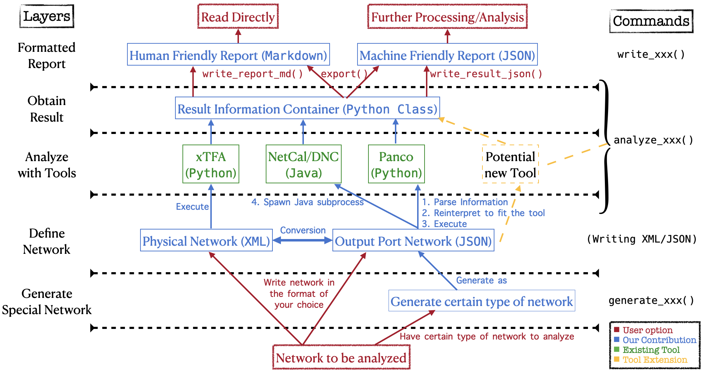
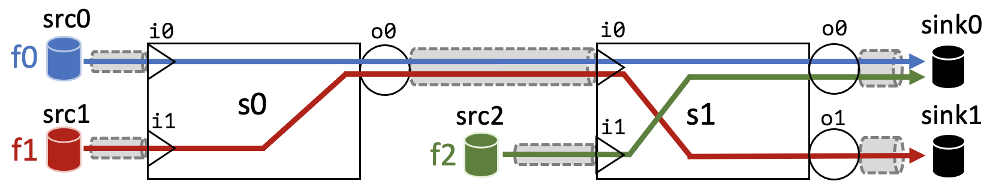
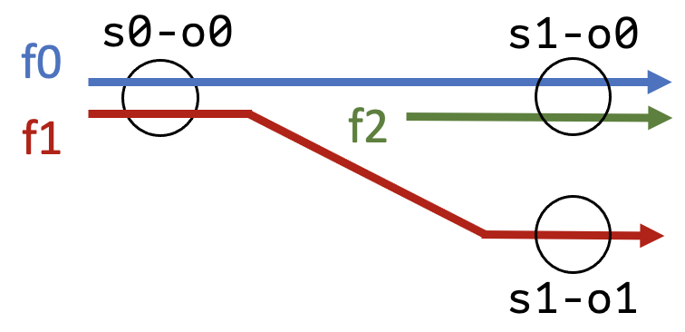
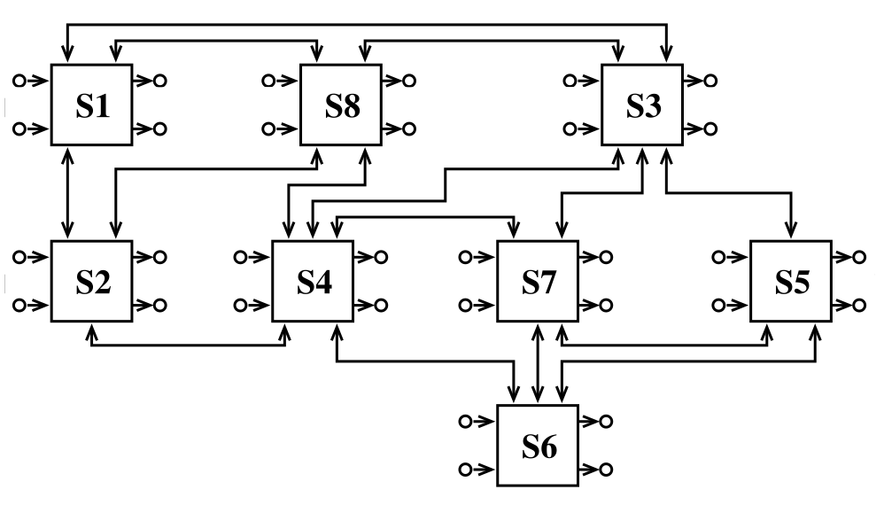

Saihu: A Common Interface of Worst-Case Delay Analysis Tools for Time-Sensitive Networks
=======================
Author: Chun-Tso Tsai

Advisors: Seyed Mohammadhossein Tabatabaee, Stéphan Plassart, Jean-Yves Le Boudec

Institute: Computer Communications and Applications Laboratory 2 (LCA2), École Polytechnique Fédérale de Lausane (EPFL)

Table of Contents
========================
- [Saihu: A Common Interface for Worst-Case Delay Analysis of Time-Sensitive Networks](#saihu-a-common-interface-for-worst-case-delay-analysis-of-time-sensitive-networks)
- [Table of Contents](#table-of-contents)
- [Introduction](#introduction)
  - [Cite this project](#cite-this-project)
  - [Pipeline](#pipeline)
  - [Credit](#credit)
- [Project Structure](#project-structure)
  - [File description](#file-description)
  - [Credits to Files](#credits-to-files)
- [Installation](#installation)
  - [Requirements](#requirements)
  - [Dependencies](#dependencies)
- [How to Use](#how-to-use)
  - [Network Description File](#network-description-file)
    - [Network Definition](#network-definition)
    - [Physical Network](#physical-network)
    - [Output-Port Network](#output-port-network)
  - [Analysis Tools](#analysis-tools)
    - [Tool Specification](#tool-specification)
    - [Public Methods](#public-methods)
    - [Init](#init)
    - [set\_shaping\_mode](#set_shaping_mode)
    - [convert\_netfile](#convert_netfile)
    - [analyze\_all](#analyze_all)
    - [analyze\_xtfa](#analyze_xtfa)
    - [analyze\_linear](#analyze_linear)
    - [analyze\_panco](#analyze_panco)
    - [analyze\_dnc](#analyze_dnc)
    - [export](#export)
    - [write\_result\_json](#write_result_json)
    - [write\_report\_md](#write_report_md)
    - [clear](#clear)
  - [Network Generation](#network-generation)
    - [Certain Network Type](#certain-network-type)
    - [Random Network with Fixed Topology](#random-network-with-fixed-topology)
- [Example](#example)
  - [Specific Tools](#specific-tools)
  - [Selecting Shaper](#selecting-shaper)
  - [Specific Networks](#specific-networks)
    - [Late assignment of network](#late-assignment-of-network)
    - [Multiple networks](#multiple-networks)
    - [Incorrect type of network](#incorrect-type-of-network)
  - [Generate Network and Analysis](#generate-network-and-analysis)
- [Extend this Project](#extend-this-project)
  - [Files](#files)
  - [Standard Analysis Result](#standard-analysis-result)
- [Contact](#contact)


# Introduction
**Time-Sensitive Networking (TSN)** analysis focuses on giving deterministic delay or backlog guarantees. This project integrates 4 different TSN analysis tools, including `Linear TFA Solver`, [NetCal/DNC](https://github.com/NetCal/DNC), [xTFA](https://gitlab.isae-supaero.fr/l.thomas/xtfa), and [panco](https://github.com/Huawei-Paris-Research-Center/panco). The users can use a common interface to compute network delay bounds obtained by different tools, and write the results into a formated report. All these actions requires only a few lines of code.

A introductory video of the Saihu project is available on [YouTube](https://youtu.be/MiOhLay8Kr4).

The name **SAIHU** comes from **S**uperimposed worst-case delay **A**nalysis **I**nterface for **H**uman-friendly **U**sage." It’s also inspired by the Taiwanese word ‘師傅 (sai-hū)’, which means a master, an expert, or a qualified worker.

## Cite this project
This repo is the official implementation of [Saihu: A Common Interface of Worst-Case Delay Analysis Tools for Time-Sensitive Networks](https://doi.org/10.48550/arXiv.2303.14565). To cite this project, please use the following information
```bibtex
@misc{tsai2023saihu,
      title={Saihu: A Common Interface of Worst-Case Delay Analysis Tools for Time-Sensitive Networks}, 
      author={Chun-Tso Tsai and Seyed Mohammadhossein Tabatabaee and Stéphan Plassart and Jean-Yves Le Boudec},
      year={2023},
      eprint={2303.14565},
      archivePrefix={arXiv},
      primaryClass={cs.NI}
}
```

## Pipeline
Below states the pipeline and structure of Saihu.



From the bottom up, users have the option to use the interface according to the attributes and arrows labelled in red. The blue parts are the functions being handled inside Saihu interface, which integrates the tools labelled in green. The yellow part labels the work one need to do to include more tools in Saihu.

## Credit
Here are the authors that implemented the individual tools used in this project.
- `Linear TFA Solver`: I implemented it myself following the TFA algorithm used in [Trade-off between accuracy and tractability of Network Calculus in FIFO networks](https://doi.org/10.1016/j.peva.2021.102250).
- `xTFA`: This tool is implemented in `Python` by [Ludovic Thomas](https://people.epfl.ch/ludovic.thomas/?lang=en). You may refer to the following academic reference:
    ```bibtex
    @PHDTHESIS{thoma2022analyse,
        url = "http://www.theses.fr/2022ESAE0041",
        title = "Analysis of the side-effects on latency bounds of combinations of scheduling, redundancy and synchronization mechanisms in time-sensitive networks",
        author = "Thomas, Ludovic",
        year = "2022",
        note = "Thèse de doctorat dirigée par Mifdaoui, Ahlem et Le Boudec, Jean-Yves Informatique et Télécommunications Toulouse, ISAE 2022",
        school = "l'Institut Supérieur de l'Aéronautique et de l'Espace (ISAE-SUPAERO)"
    }
    ```

- `NetCal/DNC`: This tool is implemented in `JAVA` by the NetCal team. You can visit [their repository](https://github.com/NetCal/DNC) and here are the academic references:
    - Arbitrary Multiplexing:
    ```bibtex
    @inproceedings{DiscoDNCv2,
        author    = {Steffen Bondorf and Jens B. Schmitt},
        title     = {The {DiscoDNC} v2 -- A Comprehensive Tool for Deterministic Network Calculus},
        booktitle = {Proc. of the International Conference on Performance Evaluation Methodologies and Tools},
        series    = {ValueTools '14},
        pages     = {44--49},
        month     = {December},
        year      = 2014,
        url       = {https://dl.acm.org/citation.cfm?id=2747659}
    }
    ```
    - FIFO Multiplexing:
    ```bibtex
    @inproceedings{LUDBFF,
        author    = {Alexander Scheffler and Steffen Bondorf},
        title     = {Network Calculus for Bounding Delays in Feedforward Networks of {FIFO} Queueing Systems},
        booktitle = {Proc. of the 18th International Conference on Quantitative Evaluation of Systems},
        series    = {QEST '21},
        pages     = {149--167},
        month     = {August},
        year      = 2021,
        url       = {https://link.springer.com/chapter/10.1007/978-3-030-85172-9_8}
    }
    ```
- `panco`: The tool is implemented in `Python` by [Anne Bouillard](https://ieeexplore.ieee.org/author/38526153500) at Huawei Paris Research Center. Here is the [original repository](https://github.com/Huawei-Paris-Research-Center/panco). The following is the academic reference:
    ```
    @article{BOUILLARD2022102250,
        title    = {Trade-off between accuracy and tractability of Network Calculus in FIFO networks},
        journal  = {Performance Evaluation},
        volume   = {153},
        pages    = {102250},
        year     = {2022},
        issn     = {0166-5316},
        doi      = {https://doi.org/10.1016/j.peva.2021.102250},
        url      = {https://www.sciencedirect.com/science/article/pii/S0166531621000675},
        author   = {Anne Bouillard},
        keywords = {Network Calculus, FIFO systems, Linear programming},
        abstract = {Computing accurate deterministic performance bounds is a strong need for communication technologies having stringent requirements on latency and reliability. Within new scheduling protocols such as TSN, the FIFO policy remains at work inside each class of communication. In this paper, we focus on computing deterministic performance bounds in FIFO networks in the Network Calculus framework. We propose a new algorithm based on linear programming that presents a trade-off between accuracy and tractability. This algorithm is first presented for tree networks. Next, we generalize our approach and present a linear program for computing performance bounds for arbitrary topologies, including cyclic dependencies. Finally, we provide numerical results, both of toy examples and realistic topologies, to assess the interest of our approach.}
    }
    ```


# Project Structure

    .
    └- README.md
    └- tool-usage.md
    └- LICENSE.txt
    └- src/
       └- environment.yml
       └- setup.py
       └- main.py
       └- example/
       │  └- example.py
       │  └- demo.json
       │  └- demo.xml
       │  └- demo_report.md
       │  └- demo_data.json
       │
       └- saihu/
          └- interface.py
          └- result.py
          └- javapy/
          │  └- dnc_analysis.jar
          │  └- dnc_exe.py
          │  └- NetworkAnalysis
          │     └- NetArgParser.java
          │     └- NetworkScriptHandler.java
          │     └- NetworkAnalysis.java
          │     └- FileGetter.java
          │
          └- Linear_TFA/
          │  └- Linear_TFA.py
          │  └- ...
          │
          └- xTFA/
          │  └- ...
          │
          └- panco/
          │  └- lp_solve
          │  └- lpSolvePath.py
          │  └- panco_analyzer.py
          │  └- ...
          │
          └- netscript/
          │  └- netdef.py
          │  └- netscript.py
          │  └- net_gen.py
          │  └- unit_util.py
          │
          └- resources/
             └- paths.json

## File description
- `setup.py`: Python package installation file.
- `main.py`: Direct command line usage entrance point.
- `interface.py`: The general interface to use the analysis tools. Generally speaking, user can only import function from here to access all functionalities.
- `result.py`: The formated result class from all tools.
- `enviornments.yml`: Python environment requirements.
- `example/`:
    - `example.py`: Example on how to use it.
    - `demo.json`: A demo network definition file in output-port json format. (more detail in [Output Port Network](#output-port-network))
    - `demo.xml`: A demo network definition file in physical network XML format. (more detail in [Physical Network](#physical-network))
    - `demo_report.md`: An example of formatted human-readable report.
    - `demo_data.json`: An example of formatted `json` listing results.
- `saihu/`:
    - `javapy/`:
        - `dnc_analysis.jar`: The custom `.jar` file that can execute DNC analysis. Note that if you build a new `dnc_analysis.jar`, sometimes you may need the following command to make it executable.
            ```bash
            zip -d dnc_analysis.jar 'META-INF/*.SF' 'META-INF/*.RSA' 'META-INF/*.DSA'
            ```
        - `dnc_exe.py`: The `Python` implementation on executing `dnc_analysis.jar` and capture the results.
        - `NetworkAnalysis`: A folder that represents a java package of my implementation on the interaction between my interface and DNC tool.
            - `NetArgParser.java`: Parsing the input arguments.
            - `NetworkScriptHandler.java`: Construct a DNC `ServerGraph` object for further analysis based on the input network description file.
            - `NetworkAnalysis`: Perform analysis given the tools specified in input arguments and print them in `.json` format.
            - `FileGetter`: Helper class to resolve paths and get files.
    - `Linear_TFA/Linear_TFA.py`: The implementation of `Linear TFA solver`.
    - `xTFA/`: The original `xTFA` module from [xTFA](https://gitlab.isae-supaero.fr/l.thomas/xtfa)
    - `panco/`:
        - `...`: The original `panco` module from [panco](https://github.com/Huawei-Paris-Research-Center/panco)
        - `lp_solve`: The `lp_solve` executable downloaded and installed from [lpsolve](https://sourceforge.net/projects/lpsolve/)
        - `lpSolvePath.py`: You need to change `LPSOLVEPATH` in this file if you place your lpsolve executable at a different directory.
        - `panco_analyzer.py`: To load and build networks, and performing analysis using `panco` tools.
    - `netscript/`:
        - `netdef.py`: The `Python` representation of physical network in _WOPANet_ `.xml` format and output-port abstraction of `.json` format.
        - `netscript.py`: The sciprt handler to manipulate network definition files.
        - `net_gen.py`: Methods to automatically generate interleave/ring/mesh network with arbitrary number of homogeneous servers.
        - `unit_util.py`: Methods to do multiplier/unit parsing and manipulation.
    - `resources/`:
        - `paths.json`: Stores paths to locate `cplex` and `lpsolve`. `cplex` path is used only for `LUDB` method of `DNC`. This `lpsolve` address is only used when no `lp_solve` is in `panco`.
- `README.md`: This `README`
- `tool-usage.md`: Brief description of the included tools.

## Credits to Packages
- `NetCal/DNC`: The file `dnc_analysis.jar` is built based on the project [DNC](https://github.com/NetCal/DNC). I only implemented `NetworkAnalysis` package to allow analysing with `DNC` while using my network description file as input and my standard result format as output. More you can find more details about my input/output at [network description file](#network-description-file) and [standard result](#standard-analysis-result).
- `xTFA`: All files under the folder `xtfa` are implemented by [Ludovic Thomas](https://people.epfl.ch/ludovic.thomas/?lang=en) on this [repository](https://gitlab.isae-supaero.fr/l.thomas/xtfa).
- `panco`: Under the folder `panco`, I only implemented `panco_analyzer.py` to bridge my input/output format to panco tools. All files other than `panco_analyzer.py` and `lp_solve` are credited to [Anne Bouillard](https://ieeexplore.ieee.org/author/38526153500) with the complete project at [this repository](https://github.com/Huawei-Paris-Research-Center/panco)

# Installation
Please install the following requirements on your machine.

You can quickly build the project using `setup.py` by
```bash
pip install -e .
```

## Requirements
- `lpsolve`: Download and installed from [lpsolve](https://sourceforge.net/projects/lpsolve/). The `lp_solve` in the project is built on `macOS 12.6`, you may need to build a different version on your machine.
- `CPLEX`: Licensed tool from IBM. Only used for `LUDB` of `DNC`, otherwise you can ignore this dependency. Once you install `CPLEX` on your device, please specify its folder containing CPLEX executable in `cplex` inside [`resources/paths.json`](./src/saihu/resources/paths.json).
- `Java`: `JDK 16.0.2`
- `Python`: Create an environment using `environment.yml` or installing `numpy`, `networkx`, `matplotlib`, `pulp`, and `mdutils` with `Python>=3.9`.

## Dependencies
You may also choose to not install the environment if you choose not to use all tools included in this module. Here are the list of dependency to each tool, you may refer to this list to decide which environment setting you need.
- `Saihu`: This is a **MUST-HAVE** to use the interface. Requires `Python>=3.9`/`numpy`/`networkx`/`matplotlib`/`mdutils`
- `panco`: Requires `Python`/`lpsolve`/`panco package`
- `Linear TFA`: Requires `Python`/`pulp`
- `xTFA`: Requires `Python`/`xtfa package`
- `DNC`: Requires `Java` with `JDK 16` and `CPLEX` if you want to use `LUDB`.

# How to Use
You need to write your network in one of the network description format specified below. Then use the Python interface to do the analysis.
You would also be able to generate a network by the built-in network generating functions specified in [Network Generation](#network-generation).
## Network Description File
The tool accepts 2 formats of network description files. The first is **Physical Network** and the other is **Output Port Network**. Please find the detail below.

### Network Definition
In this section, we briefly introduce the relation between the 2 formats.

Take the following network as an example

This network consists of 
- 3 flows: `f0`, `f1` and `f2`. Their paths are labelled with blue, red and green respectively. 
- 2 switches: `s0` and `s1` with `i[x]` and `o[x]` being their input/output ports.
- 5 end-stations: `src0`, `src1`, `src2`, `sink0` and `sink1`.
- 6 links: Labelled as grey cylinders.

Each source of flow (`src[x]`) provides data flow modelled as an arrival curve composed of token-bucket curves; while each output port provides service to process these data with a service curve composed of rate-latency curves.

A **Physical Network** aims at directly describing the above network.

On the other hand, since the delay are mostly caused by data flows competing the resource of output ports, we can directly model the network as output ports as follows
<p style="text-align:center;"></p>

Here we remove most details and only focus on the output ports. The 3 flows provides data modelled by an arrival curve, and the 3 involved output ports process them with under the model of their service curves. This abstraction still captures the essential of the network, one can derive the same delay bound at each output port as the completed physical network.
We refer this abstracted network as an **Output Port Network**.
### Physical Network
In this section, we introduce the format to define a physical network.

A physical network is defined in `WOPANet` format as a `.xml` file. It contains only one `elements` with the following attributes:
- `network`: Has the following attributes
    - `name`: Name of the network
    - `technology`: Global specifications connected by _"+"_, where you can use
        1. `FIFO`: FIFO property
        2. `IS`: Input shaper
        3. `PK`: Packetizer
        4. `CEIL`: Fixed precision, can reduce computation time but slightly reduce precision.
        5. `MOH` and `TDMI`: Can improve delay bounds. For technical details please contact the author of `xTFA` [Ludovic Thomas](mailto:ludovic.thomas@epfl.ch).
    - Other attributes are optional, but used as a global parameter. If some parameters are not specified in each server/flow, the system uses the global parameter defined here instead.

    Example:
    ```xml
	<network name="example-network" technology="FIFO+IS+CEIL" overhead="0" maximum-packet-size="0"/>
    ```
- `station`/`switch`: The two names would not affect the analysis result, but for representing the physical network and readability. Can have the following attributes
    - `name`: Name of station/switch.
    - `service-latency`: The latency of the rate-latency curve. Can assign different time units, `s`/`ms`/`us`, etc.
    - `service-rate`: The service rate of the rate-latency curve. Can assign different rate units, `Mbps`... (But not `bps` alone)

    Example:
    ```xml
    <station service-latency="1us" service-rate="100Gbps" name="src0"/>
	<switch  service-latency="1us" service-rate="100Gbps" name="s0"/>
    ```
- `link`: Connection link between ports, has the following attributes
    - `name`: Name of link.
    - `from`: Which station/switch the link is connected from. Need to be name of station/switch.
    - `to`: Which station/switch the link is connected to. Need to be name of station/switch.
    - `fromPort`: The port number used for incoming station/switch.
    - `toPort`: The port number used for outgoing station/switch.
    - `transmission-capacity`: The transmission capacity of the link. Can assign different rate units, `Mbps`... (But not `bps` alone)

    Example:
    ```xml
	<link from="src0" to="s0" fromPort="o0" toPort="i0" transmission-capacity="200Gbps" name="src_sw_0"/>
    ```
    Note: Service curve can also be defined on links as defined on station/switch. In this way, the service curve defined on the link that directly attached to the output port would be considered first.
    Note 2: Transmission capacity can also be defined on station/switch, that would be the default capacity to all links attached to the station/switch if on capacity is defined on that link.
- `flow`: Flow of network, has attributes:
    - `name`: Name of flow
    - `arrival-curve`: Type of arrival curve, `leaky-bucket` for example. The curve can also be periodic but currently tools other than `xTFA` can not process it.
    - `lb-burst`: burst of leaky-bucket curve. Can assign different data units, `B` for Byte or `b` for bit, defulat is `B`.
    - `lb-rate`: arrival rate of leady-bucket curve. Can assign different rate units, `Mbps`... (But not `bps` alone)
    - `source`: The source of this flow, must be a station or switch.
    
    A `flow` element can have multiple paths thus representing a _multicast_ flow. Note that only the physical network format supports defining multicast flow.
    - `target`: Each target is a path, can assign a `name` to it. A list of nodes is written as its sub-element-tree. Each node is specified by a `path` entry with attribute `node` equals to a station/switch.

    Example:
    ```xml
    <flow name="f0" arrival-curve="leaky-bucket" lb-burst="1b" lb-rate="1" source="st-0">
        <target name="p1">
            <path node="sw0"/>
            <path node="sw1"/>
            <path node="sw2"/>
            <path node="sw3"/>
	    </target>
        <target name="p2">
            <path node="sw0"/>
            <path node="sw3"/>
            <path node="sw5"/>
            <path node="sw6"/>
        </target>
	</flow>
    ```

### Output-Port Network
An Output-port network is defined as a `.json` file. It contains only one `JSON Object` with the following attributes:
- `network`: General network information, for example
    ```json
    "network": {
        "name": "my network",
        "packetizer": false,
        "multiplexing": "FIFO",
        "analysis_options": ["IS"],
        "time_unit": "us",
        "data_unit": "MB",
        "rate_unit": "Gbps"
    }
    ```
    - `name`: Name of network
    - `packetizer`: Whether to apply packetizer
    - `multiplexing`: Multiplexing policy, either `FIFO` or `ARBITRARY`
    - `analysis_option`: Additional options, takes the same arguments as `technology` in physical network format.
    - `time_unit`/`data_unit`/`rate_unit`: Default units used in the following sections
- `flows`: array of flows, each flow has the following attributes
    - `name`: Name of flow
    - `path`: An array to represent path of flow, written as names of servers defined in `servers`. 
    - `arrival_curve`: A multi-segment curve, which has 2 attributes `bursts` and `rates`. Both attributes are arrays and must have the same length. Burst and arrival rate wit hthe same index correspond to a token-bucket curve, and the final arrival curve is defined as minimum of all these curves.
    - `max/min_packet_length`: The maximum/minimum packet length of the flow.

    Example:
    ```json
    "flows": [
        {
            "name": "f0",
            "path": ["s0-o0", "s1-o0"],
            "arrival_curve": {
                "bursts": [1, "5GB"],
                "rates": [10, "100Gbps"]
            },
            "max_packet_length": 20,
            "min_packet_length": "1B",
            "data_unit": "kB"
        }
    ]
    ```

    Note that all flows in the output port format are assumed to be _unicast_ flows. If it's converted from a physical network with multicast flows, the multicast paths will be split into multiple unicast flows with the same arrival curve and source.

- `servers`: an array of servers, each server has the following attributes
    - `name`: Name of server
    - `service_curve`: A multi-segment curve, which has 2 attributes `latencies` and `rates`. Both attributes must have the same length. Latency and service rate with the same index correspond to a rate-latency curve. The final service curve is the maximum of all these curves.
    - `capacity`: The output capacity of the server.

    Example:
    ```json
    "servers": [
        {
            "name": "s0-o0",
            "service_curve": {
                "latencies": [1e-2, "10ms"],
                "rates": ["2Gbps", "30Gbps"]
            },
            "capacity": 100,
            "rate_unit": "Gbps"
        }
    ]
    ```

## Analysis Tools
### Tool Specification
- Available method for tools
    | Method\Tool |  DNC  | xTFA  | Panco | Linear TFA |
    | :---------: | :---: | :---: | :---: | :--------: |
    |   **TFA**   |   V   |   V   |   V   |     V      |
    |   **SFA**   |   V   |       |   V   |            |
    |   **PLP**   |       |       |   V   |            |
    |   **ELP**   |       |       |   V   |            |
    |  **PMOO**   |   V   |
    |   **TMA**   |   V   |
    |  **LUDB**   |   V   |

    Note: TMA stands for Tandem Matching Analysis
    
- Constraints
    |          Spec\Tool           |  DNC  | xTFA  | Panco | Linear TFA |
    | :--------------------------: | :---: | :---: | :---: | :--------: |
    |   **Manual Tune Shaping**    |       |   V   |   V   |     V      |
    | **Cyclic Dependent Network** |       |   V   |   V   |     V      |
    |      **Multicast Flow**      |       |   V   |       |

    Note: 
    1. `DNC` cannot set output shaping together with _FIFO_ multiplexing, unless you are using _Arbitrary_ multiplexing (for PMOO or TMA). 
    2. `Panco-ELP` doesn't allow cyclic dependent network.
    3. Multicast flow can only be defined as a physical network.

### Command Line Exection
Use Saihu via command line is possible with [main.py](src/main.py). Once you define a network in either of the formats mentioned in [Network Description File](#network-description-file), you can analyze your network file via the commands line tool below.

#### Arguments

- `networkFile`: Mandatory positional argument to specify path of the target network description file
- `-h`, `--help`: print the help message
- `-a`, `--all`: A flag to execute all tools and methods
- `-m`, `--method`: Analyze using the methods with all tools that support these methods
- `-t`, `--tool`: Analyze using the tools with all available methods with them
- `-x`, `--xtfa`: Analyze using `xTFA` with methods following this argument, can be `TFA`
- `-d`, `--dnc`: Analyze using `DNC` with methods following this argument, can be `TFA`, `SFA`, `PMOO`, `TMA`, or `LUDB`
- `-p`, `--panco`: Analyze using `Panco` with methods following this argument, can be `TFA`, `SFA`, `PLP`, or `ELP`
- `--shaping`: Set shaping mode as either `AUTO`, `ON` or `OFF`, by default `AUTO`
- `-e`, `--export`: Name stem of reports to be exported, see the argument `default_name` of function [export](#export)
- `--markdown`: Human-friendly markdown report file name
- `--json-out`: Machine-friendly JSON report file name

The priority of the arguments are different. For the arguments regarding tool/method selection, the script search the arguments in the following order: `all` > `method` > `tool` > `xtfa` = `dnc` = `panco`. If a higher priority argument is found, the rest will not be considered.

For the report file related arguments, it's `markdown` = `json-out` > `export`. If non of the three arguments are specified, then it exports the result using the input file name `networkFile` as naming stem. i.e. `python main.py <filename>.<ext> ...` equals `python main.py <filename>.<ext> -e <filename> ...`

All names of tools and methods are case insentisive in Saihu.

#### Examples

For example, you have a network description file `myNet.json`

* **Select tools and methods**

    ```bash
    # Analyze with all tools and methods available
    python main.py myNet.json -a
    # Analyze using TFA, PLP, and LUDB with all tools supporting them
    python main.py myNet.json -m tfa plp ludb
    # Analyze using all methods in DNC and Panco
    python main.py myNet.json -t dnc panco
    # Analyze with TFA in xTFA; SFA and LUDB in DNC; and PLP in Panco
    python main.py myNet.json -x tfa -d sfa ludb -p plp
    ```

    All the above examples generate `myNet_data.json` and `myNet_report.md`.

* **Specify report file name**

    ```bash
    # Write "myname_data.json" and "myname_report.md"
    python main.py myNet.json -a -e myname
    # Write markdown "myMD.md"
    python main.py myNet.json -a --markdown myMD.md
    # Write json "myJSON.json"
    python main.py myNet.json -a --json-out myJSON.json
    ```

### Public Methods
To use our general interface, you need to first import class `TSN_Analyzer` from the file `saihu/interface.py`.
```python
from saihu.interface import TSN_Analyzer
```
Here is a list of all available methods
* [init](#init)
* [set_shaping_mode](#set_shaping_mode)
* [convert_netfile](#convert_netfile)
* [analyze_all](#analyze_all)
* [analyze_xtfa](#analyze_xtfa)
* [analyze_linear](#analyze_linear)
* [analyze_panco](#analyze_panco)
* [analyze_dnc](#analyze_dnc)
* [export](#export)
* [write_result_json](#write_result_json)
* [write_report_md](#write_report_md)
* [clear](#clear)

### Init
An analyzer can be initialized by
```python
analyzer = TSN_Analyzer(netfile, temp_path, shaping)
```
All arguments are optional, each of them represents
- `netfile`: The path to the network definition file, either a physical network or an output-port network.
- `temp_path`: The path to the tempary directory to put the execution artifacts.
- `output_shaping`: A string to select output shaping mode, can be _AUTO_, _ON_, or _OFF_. Default is _AUTO_, which means to consider output shaping if possible.

### set_shaping_mode
```python
analyzer.set_shaping_mode(mode)
```
Set the output shaping usage of the analyzer by a string of either _AUTO_, _ON_, or _OFF_. _AUTO_ means considering output shaping if possible. _ON_ and _OFF_ are forcing analyzer to consider output shaping or not, and don't compute result if not possible.

### convert_netfile
```python
outputport_net_file, physical_net_file = analyzer.convert_netfile(in_netfile, out_netfile, target)
```
Convert a network description file from either physical network or output-port network and return both paths of network definition files, where one is converted from the original infile.
- `in_netfile`: The path to input network description file in either physical network ending in `.xml` or output-port port network ending in `.json`.
- `out_netfile`: (Optional) The output path you want to store the converted file. If not assigned, it automatically generate a file in `temp_path` with name `tempnet`.
- `target`: (Optional) String of either `json` or `xml`. Return the target format only with the other output being `None` if target is specified and no conversion needed. Default is `None`, where it outputs both formats anyway.

The 2 return values are paths to the network description files, one is the output-port network and the other is the physical network.

### analyze_all
```python
num_results = analyzer.analyze_all(methods, netfile, use_tfa, use_sfa)
```
Use all available tools to do analysis given the methods. Return number of results that are computed.
All parameters are **optional**:
- `methods`: A list of strings or a string specifying the analysis method. For the available values please refer to [Tool Specification](#tool-specification).
- `netfile`: Executing using a specific network description file, use the one stored in the `analyzer.netfile` if it's `None`.
- `use_tfa`/`use_sfa`: Boolean variables to select whether to use TFA/SFA bounds for improving PLP bounds. Only relevant when using `panco`. Default is both `True`.

The function returns the number of results loaded from the process.

### analyze_xtfa
```python
analyzer.analyze_xtfa(methods, netfile)
```
Analyze the network with `xTFA`. All parameters are optional:
- `methods`: A list of strings or a string specifying the analysis method. For the available values please refer to [Tool Specification](#tool-specification).
- `netfile`: Executing using a specific network description file, conversion is done if needed. Use the network stored in the `analyzer.netfile` if it's `None`.

### analyze_linear
```python
analyzer.analyze_linear(methods, netfile)
```
Analyze the network with `Linear TFA solver`. All parameters are optional:
- `methods`: A list of strings or a string specifying the analysis method. For the available values please refer to [Tool Specification](#tool-specification).
- `netfile`: Executing using a specific network description file, conversion is done if needed. Use the network stored in the `analyzer.netfile` if it's `None`.

### analyze_panco
```python
analyzer.analyze_panco(methods, netfile, use_tfa, use_sfa)
```
Analyze the network with `panco`. All parameters are optional:
- `methods`: A list of strings or a string specifying the analysis method. For the available values please refer to [Tool Specification](#tool-specification).
- `netfile`: Executing using a specific network description file, use the one stored in the `analyzer.netfile` if it's `None`.
- `use_tfa`/`use_sfa`: Boolean variables to select whether to use TFA/SFA bounds for improving PLP bounds. Only relevant when using PLP. Default is both `True`.

### analyze_dnc
```python
analyzer.analyze_panco(methods, netfile)
```
Analyze the network with `DNC`. All parameters are optional:
- `methods`: A list of strings or a string specifying the analysis method. For the available values please refer to [Tool Specification](#tool-specification).
- `netfile`: Executing using a specific network description file, use the one stored in the `analyzer.netfile` if it's `None`.

### export
```python
analyzer.export(default_name, result_json, report_md, clear)
```
Write the JSON result and Markdown report at the same time. All parameters are optional:
- `default_name`: The default file name stem if either `result_json` or `report_md` are not assigned or `None`. For example,
    ```python
    analyzer.export("test")
    ```
    writes 2 files: `test_data.json` and `test_report.md`.
    
    If no default name is specified, it takes the name of network description file without file extension. e.g. a network description file `my_net.json` writes `my_net_data.json` and `my_net_report.md` with no default name is specified.

- `result_json`: The file name of the JSON output
- `report_md`: The file name of the Markdown report
- `clear`: Boolean deciding whether to clear the analyzer after finishing writing. Default is `True`.

### write_result_json
```python
analyzer.write_result_json(output_file, clear)
```
Write the analyze result report from all the stored results.
- `output_file`: File name of the analysis result in JSON.
- `clear`: (Optional) Boolean deciding whether to clear the analyzer after finishing writing. Default is `True`.

### write_report_md
```python
analyzer.write_report_md(output_file, clear)
```
Write the analyze result report from all the stored results.
- `output_file`: File name of the report to be generated
- `clear`: (Optional) Boolean deciding whether to clear the analyzer after finishing writing. Default is `True`.


### clear
Reset the analyzer.
```python
analyzer.clear()
```

## Network Generation
### Certain Network Type
Use functions from `src/netscript/net_gen.py`, there are 3 types of network that can be generated automatically. All servers and flows would have the same arrival curve, service curve, and shaper. Networks will be generated into output-port network in `.json` format.
- `generate_interleave_tandem()`
    The network with a interleaved chain topology. i.e. **s0** -> **s1** -> ... -> **sn-1**. 1 flow goes through all servers, and $n-1$ flows go from $k \rightarrow k+1$ for $k \in [0, n-2]$
- `generate_ring()`
    The network with a ring topology. i.e. **s0** -> **s1** -> ... -> **sn-1** -> **s0**. $n$ flows go from $k \rightarrow k-1\ mod\ n$
- `generate_mesh()`
    The network with a mesh topology. i.e.
    ```
    ------   ------      --------
    | s0 | - | s2 | ---- | sn-2 |
    ------   ------      --------   ------
           X        X ...         > | sn |
    ------   ------      --------   ------
    | s1 | - | s3 | ---- | sn-1 |
    ------   ------      --------
    ```
    Flows are all $2^{n/2}$ possible combinations from **s0** or **s1** to **sn**.

All 3 methods take the same parameters:
- `size`: The number of servers in the network.
- `burst`: The burst of arrival curve of each flow.
- `arrival_rate`: The arrival rate of arrival curve of each flow.
- `max_packet_length`: Packet length of each flow.
- `latency`: Latency of each server.
- `service_rate`: Service rate of each server.
- `capacity`: The transmission capacity of each server.
- `save_dir`: (Optional) The output file to store the generated network. Default is `None`, which is not writing the network to file, but return a dictionary of all information instead (the dictionary as loaded from a `.json` file.)

### Random Network with Fixed Topology
One can also generate a random network from a fixed topology.
The user can choose how many flows are going into this network and the arrival/service curve specifications, this function automatically generates a corresponding output-port network (JSON) to represent it.

Say one would like to randomly generate a network with this following switch inter-connection (source: [Deficit Round-Robin: A Second Network Calculus Analysis](https://ieeexplore.ieee.org/document/9470448)):
<p style="text-align:center;"></p>
Then one can generate a network as follows:
```python
connections = {
    "S1": [      "S2", "S3",                         "S8"],
    "S2": ["S1",             "S4",                   "S8"],
    "S3": ["S1",             "S4", "S5",       "S7", "S8"],
    "S4": [      "S2", "S3",             "S6", "S7", "S8"],
    "S5": [            "S3",             "S6", "S7"],
    "S6": [                  "S4", "S5",       "S7"],
    "S7": [            "S3", "S4", "S5", "S6"],
    "S8": ["S1", "S2", "S3", "S4"]
}
generate_fix_topology_network(num_flows=30, connections=connections,
                              burst="10B", arrival_rate=("200bps", "20kbps"), max_packet_length="6kB",
                              latency=("2us", "200ms"), service_rate=("1Mbps", "50Mbps"), capacity="100Mbps",
                              save_dir="rand_net.json",
                              link_prob=0.9)
```
The above code generates 30 flows within the given topology, and dump the output port network as `rand_net.json`. Note that the flow/server parameters can be decided randomly or deterministically. The above example shows that for `burst` it's a constant `"10B"` (10 Bytes) whereas other parameters are decided uniform-randomly among a (min, max) value pair.

**Parameters**
- `num_flows`: number of flows to be generated in the network
- `connections`: possible connections between switches. key=name of switch; value=list of switch's name that "key" can connect to. e.g.
    ```python
    connections = {
        "s1": ["s2", "s3"],
        "s2": ["s3"],
        "s3": ["s1", "s2"]
    }
    ```
    this means 's1' can go to 's2' & 's3'; 's2' can go to 's3'; and 's3' can go to 's1' & 's2'
- `burst`: burst of arrival curve, can be 
    1. `float`: a direct assignment. e.g. `2.0`
    2. `str`: a constant assignment with unit. e.g. `"2.5kB"`
    3. `Iterable`: length 2 indicating min and max value, the burst value will be selected randomly between min & max. e.g. `("100b", "5kB")`
- `arrival_rate`: arrival rate of arrival curve, can be 
    1. `float`: a direct assignment. e.g. `2.0`
    2. `str`: a constant assignment with unit. e.g. `"2.5Mbps"`
    3. `Iterable`: length 2 indicating min and max value, the rate value will be selected randomly between min & max. e.g. `("1kbps", "50Mbps")`
- `max_packet_length`: maximum packet length of a flow, can be 
    1. `float`: a direct assignment. e.g. `2.0`
    2. `str`: a constant assignment with unit. e.g. `"10kB"`
- `latency`: latency of service curve, can be 
    1. `float`: a direct assignment. e.g. `2.0`
    2. `str`: a constant assignment with unit. e.g. `"2.5ms"`
    3. `Iterable`: length 2 indicating min and max value, the latency value will be selected randomly between min & max. e.g. `("10us", "20ms")`
- `service_rate`: service rate of service curve, can be 
    1. `float`: a direct assignment. e.g. `2.0`
    2. `str`: a constant assignment with unit. e.g. `"2.5Mbps"`
    3. `Iterable`: length 2 indicating min and max value, the burst value will be selected randomly between min & max. e.g. `("1kbps", "50Mbps")`
- `capacity`: capacity of a link, can be 
    1. `float`: a direct assignment. e.g. `2.0`
    2. `str`: a constant assignment with unit. e.g. `"1Gbps"`
- `max_out_end_stations`: maximum number of end stations (sink) that can be attached to a switch. Default is `1`
- `network_attrib`: (Optional) Additinoal network information. Default is empty
- `server_attrib`: (Optional) Additinoal server information. Default is empty
- `flow_attrib`: (Optional) Additinoal flow information. Default is empty
- `save_dir`: (Optional) path to dump the generated file as a json output-port network. Default is `None`, where no file will be dumped
- `link_prob`: (Optional) probability $p$ to continue finding next switch, otherwise directly go to a sink. Default is `0.9`
- `rand_seed`: (Optional) random seed to feed to python `random` library. Default is `None` (random seed by time)


# Example

The simplest way to use Saihu is via command line tool using [main.py](./src/main.py) with flag `-a` (analyze with all methods and tools).
```bash
python main.py -a
```

To use Saihu as a Python package, please check [example.py](./example/example.py) for the simple example. Here I present the basic usage.
```python
from saihu.interface import TSN_Analyzer

if __name__ == "__main__":
    analyzer = TSN_Analyzer("./demo.json", temp_path="./temp/", use_shaper="AUTO")
    analyzer.analyze_all()
    analyzer.export("test")
```

## Specific Tools
While `analyze_all` tries all possible tools, you may also specify which tool you want to use. For example,
```python
analyzer = TSN_Analyzer("./demo.json")
analyzer.analyze_panco(methods=["TFA", "PLP"])
analyzer.analyze_dnc(methods="TFA")
analyzer.export("panco_dnc")     # Containing both panco and DNC results
```
Note that any function called `analyze_xxx` only puts the result into the analyzer's internal buffer. When you call `export`/`write_result_json`/`write_report_md`, it simply takes all the stored results and write them into the report. Under default setting, the buffer is cleaned after writing results.

You can also choose to not clearing the result buffer after writing a report.
```python
analyzer = TSN_Analyzer("./demo.json")
analyzer.analyze_panco(methods=["TFA", "PLP"])
analyzer.export("panco", clear=False) # Write panco results

analyzer.analyze_dnc(methods="TFA")
analyzer.export("panco_dnc") # Write results including both panco and DNC
```


## Selecting Shaper
You may change shaper selection any time you want.
```python
analyzer = TSN_Analyzer("./demo.json", use_shaper="ON")
analyzer.analyze_panco(methods=["TFA", "PLP"]) # Analysis with shaper
analyzer.set_shaper_usage("OFF")               # Turn off using shaper
analyzer.analyze_xtfa(methods="TFA")           # Analysis without shaper
analyzer.write_report_md("./demo_report.md")      # panco TFA & PLP is with shaper, xtfa is without shaper
```

## Specific Networks
### Late assignment of network
You may assign different networks every time you want to analyze.
```python
analyzer = TSN_Analyzer()
analyzer.analyze_linear(netfile="./demo.json")
analyzer.write_report_md("./linear_report.md")
```
### Multiple networks
When there are multiple networks (different network names defined in `network` attributes of description files), the program generate multiple reports for each network. The extra report files are named by adding index to the original file. For example,
```python
analyzer = TSN_Analyzer("./demo.xml", temp_path="./temp/", use_shaper="AUTO")
analyzer.analyze_all(methods=["TFA", "PLP"]) # Analyze "demo.xml"
analyzer.analyze_linear("./mesh.json")       # Analyze "mesh.json"
analyzer.write_report_md("./report.md")
```
Such code generates 2 files `report.md` and `report-1.md`, one reports `demo` and the other reports `mesh`.
However, I suggest users to manually write each result when needed because the suitable multiplier is chosen among all results.

### Incorrect type of network
The interface automatically converts the network description file when the input file is not in the right format for the tool. The desired input format for `xTFA` is physical network and all other tools take output-port network.
```python
analyzer = TSN_Analyzer("./demo.xml", temp_path="./temp/", use_shaper="AUTO")
analyzer.analyze_linear()
analyzer.write_report_md("./report.md")
```
The above analysis still gives the report although `linear TFA solver` should take a output-port network in `.json` format.

## Generate Network and Analysis
You can use the network generation functions to generate the following 3 types of networks `interleave tandem`, `ring`, and `mesh`. About their topology and how the flows are assigned, please see [Network Generation](#network-generation).
Say you would like to generate a ring network of 10 servers, you can do the following.
```python
from saihu.interface import TSN_Analyzer
from saihu.netscript.net_gen import *

generate_ring(size=10,
              burst=1,
              arrival_rate=1,
              max_packet_length=0,
              latency=1,
              service_rate=20,
              capacity=20,
              save_dir="./ring.json")
analyzer = TSN_Analyzer("./ring.json", temp_path="./temp/", use_shaper="AUTO")
analyzer.analyze_all()
analyzer.write_report_md("./ring_report.md")
```
The arguments for each type of network are the same, you can simply change `ring` to other generating functions.

# Extend this Project
This project is possible to extend for more functionality and possibly includes more TSN analysis tools. Here explains how can anyone extend the scope of this project.

## Files
Here are some files you may use/edit to allow the tool to fit your new tool.
- `interface.py`: You can add a new method in class `TSN_Analyzer` that takes the result from your new tool into a `TSN_result` class (see [here](#standard-analysis-result) for more details). This new method should be able to take 2 arguments:
    1. `netfile`: a path that specifies a network description file, it should use `self.netfile` if it's not specified. Depending on what type of network you need, you can use the private function `_arg_check` in `TSN_Analyzer` to obtain the desired input for analysis.
    2. `methods`: a list that can take method names as strings. Currently only support `TFA`, `SFA`, `PLP`, but feel free to add more since tools automatically ignores unavailable methods.

Depends on how your tool defines a network, you may need to implement the interface to take one of the [network description file format](#network-description-file), and load the analysis result into a `TSN_result` class.

- `netscript/netdef.py`: This file contains the methods to load and check the information defined in `xml` or `json` format network description files. If you decide to change the syntax required for the network description files, you may need to change the codes here.

- `netscript/netscript.py`: This file provides some methods to manipulate network description files including conversion between 2 formats; determine if a loaded network is cyclic; and get general network info.

- `netscript/unit_util.py`: This file provides utilities to parse and manipulate string of values with multipliers and units. For example, `10ms` represents 10 milliseconds and `100Gbps` represents 100 Gigabits-per-second. This file supports time, data, and data rate values.


## Standard Analysis Result
Please refer to the file `result.py`, any analysis result should be stored as a `TSN_result` class. So that you don't need to worry about how to write your result. The method `export`/`write_result_json`/`write_report_md` automatically processes `TSN_result` and write the corresponding output.
It's OK if your tool cannot fit all the properties of `TSN_result`, they all have default values, but you should at least specify `name`, `tool`, `method`, `graph`, and `flow_delays` to properly generate the report.

Here are the meaning of each property in `TSN_result`:
- `name`: Name of the network
- `tool`: Tool used in this analysis. e.g. `DNC` or `panco`
- `method`: Analysis method. e.g. `TFA` or `PLP`
- `graph`: The graph representation of the network, including unused links
- `server_delays`: Delays stored according to server names, unit in seconds. e.g. `{'s_1': 1.0, 's_2': 2.0}`
- `server_backlogs`: Delays stored according to server names, unit in bits. e.g. `{'s_1': 1, 's_2': 2}`
- `flow_paths`: Path of each flow as a list of servers according to flow names. e.g. `{'fl_1': ['s_1', 's_2']}`
- `flow_delays`: End-to-end delays of each flow. e.g. `{'fl_1': 4.0, 'fl_2': 7.0}`
- `exec_time`: Execution time of the analysis, unit in seconds
- `units`: The units used in this result
- `network_source`: The source file of the network definition
- `converted_from`: Which file it's converted from, it's an empty string if it's original

# Contact
Regarding any question/problem about this project, please contact me via E-mail: [academic](mailto:chun-tso.tsai@epfl.ch), [primary](mailto:tsai.chuntso@gmail.com), or [secondary](mailto:adfeel220@gmail.com).
